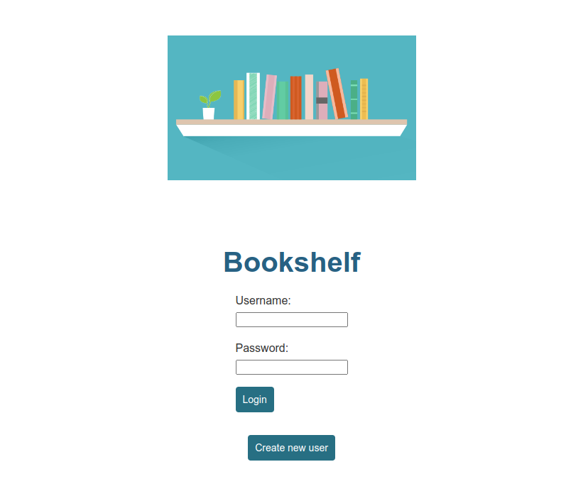
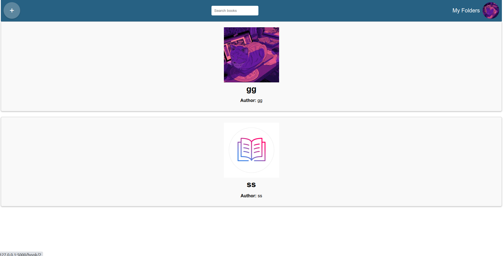
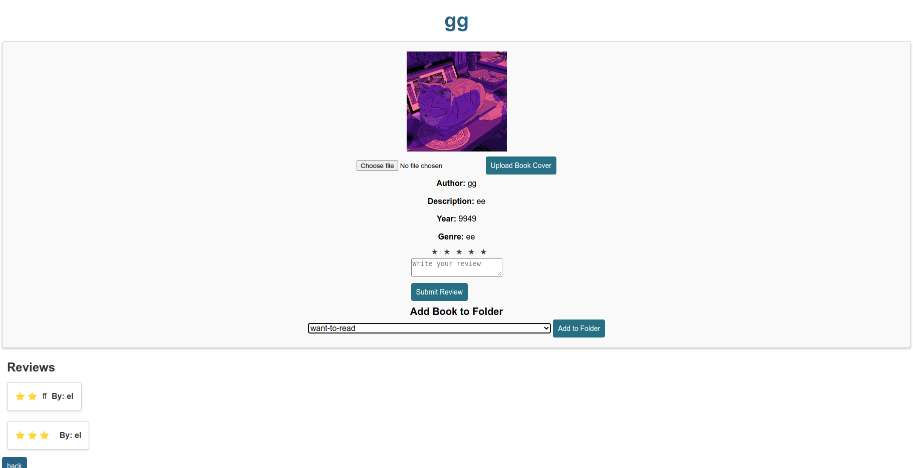

# Kirjasovelluksen käyttöohje
Kun ohjelma käynnistyy:

Painamalla create new user nappulaa, niin voit luoda uuden käyttäjän ja pääset sen jälkeen sovellukseen.
Jos sinulla on jo käyttäjä, niin voit kirjautua heti sisään.

Jos haluaa etsiä kirjoja, niin kirjoita search books kohdalle, mitää kirjaa etsit. Jos et löydä haluamasi kirjaa voi lisätä sen itse.
Painamalla + nappulaa voit kirjan sovellukseen, jos et haluakkaan lisätä kirjaa, niin paina uudestaan + nappulasta, niin saat kirjanlisäysnäkymän pois.

Painamalla My folders etusivulla, pääset katsomaan omia kansioita ja lisäämään uusia kansioita halutessasi. Painamalla, jotain tiettyä kansioo, pääset näkemään, mitä kirjoja olet lisäänyt siihen kansioon. Voit sitten poistaa halutessasi kirjan siitä kansiosta.

Painamalla profiilikuvaa oikeasta yläkulmasta, saat näkyviin valikon (profile, settings, logout). Painamalla profile, voit vaihtaa profiilikuvasi. Painamalla settings, voit vaihtaa salasanasi. Painamalla logout, pääset kirjautumaan ulos.

Painamalla kirjasta etusivulla, pääsee katsomaan kirjan yksityiskohtia ja muiden palautteita.

Kirjalle voi vaihtaa kuvan, kun painaa choose file, niin voi valita minkä kuvan haluaa kirjalle ja painaa upload book cover nappulaa. Voit antaa kirjalle palautteen kirjallisena ja tähtinä. Voit myös lisätä kirjan mihin kansioon haluat, painamalla want-to-read kohtaa, pääset näkemään myös muut kansiot.

