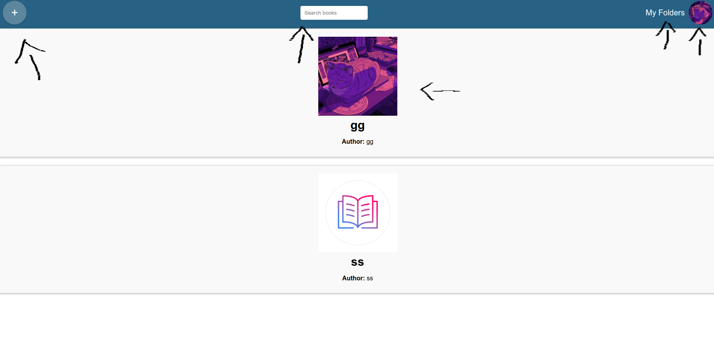

# Kirjasovelluksen käyttöohje
Kun ohjelma käynnistyy:

Luo uusi käyttäjä painamalla create new user nappulaa ja sen jälkeen pääset suoraan sovellukseen.

Jos sinulla on jo tunnukset, niin anna kirjatumistiedot ja paina login nappulaa.

Voit etsiä kirjoja kirjoittamalla search books kenttään kirjan nimen. Hakutoiminto hakee kirjan nimen alusta. Jos et löydä haluamasi kirjaa, niin voit lisätä sen itse.

Painamalla + nappulaa voit lisätä kirjan kaikkien käyttöön. Pääset kirjanlisäystilasta pois, niin paina uudestaan + nappulasta.

Pääset katsomaan omia kansioita ja lisäämään uusia kansioita painamalla My folders linkkiä etusivulla. Voit nähdä kansion sisällön painamalla jotain tiettyä kansiota. Kansiosta voit poistaa kirjoja painamalla remove book from folder nappulaa.

Painamalla profiilikuvaa oikeasta yläkulmasta, saat näkyviin valikon (profile, settings, logout). Painamalla profile, voit vaihtaa profiilikuvasi. Painamalla settings, voit vaihtaa salasanasi. Painamalla logout, pääset kirjautumaan ulos.

Painamalla kirjasta etusivulla, pääsee katsomaan kirjan yksityiskohtia ja muiden palautteita.

Kirjalle voi vaihtaa kuvan, kun painaa choose file, niin voi valita minkä kuvan haluaa kirjalle ja lopuksi paina upload book cover nappulaa. Voit antaa kirjalle palautteen teksitinä ja tähtinä. Voit myös lisätä kirjan mihin kansioon haluat, painamalla want-to-read kohtaa, pääset näkemään myös muut kansiot.

